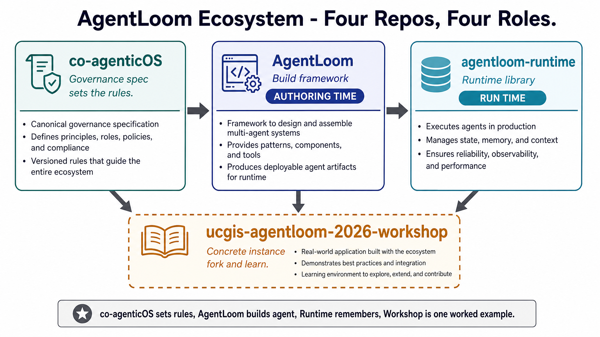
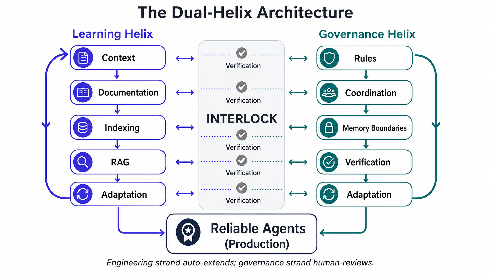

# AgentLoom

**Executable governance framework for builder agents** — knowledge graphs, propose→review→accept,
Tier-A validators, and a human review dashboard.

[](https://doi.org/10.5281/zenodo.20650518)


**Documentation:** https://keven1894.github.io/AgentLoom/

**Author:** Dr. Boyuan (Keven) Guan · FIU Library & GIS Center (affiliation for attribution only)  
**Version:** 3.0.0 (executable framework sync, June 2026)

**Project status:** Independently maintained open-source research software by
[@Keven1894](https://github.com/Keven1894) — not an FIU official product. Patterns
were generalized from production **research data lifecycle management** at an
academic library (10+ governed agents, 100+ TB under management; historical aerial
photos, GIS, time series, and real-time sensor data; FAIR publication, dashboards,
GIS cataloging, streaming, and MLOps across 14 active projects). Public repos are
framework-only — no EnviStor/Envita deployment code or production data.



---

## What this repo contains

| Layer | Path | Role |
|-------|------|------|
| **Runnable framework (v3)** | `src/agentloom/` | KG governance, validators, dashboard, propose-review (installable package) |
| **Governed data** | `agents/knowledge-graphs/`, `agents/skills/` | Knowledge graphs, skills, and behaviors the framework enforces |
| **Docs** | `docs/` | Guides, builder concepts, release notes |
| **Historical protocol** | `archive/protocol/` | Earlier v1/v2/v3 design docs and 9-phase manuals (reference only) |

**License split:** Python/scripts = [MIT](LICENSE). Markdown docs and KG content = [CC BY-NC 4.0](LICENSE-DOCS.md).

---

## Quickstart (5 minutes)

```bash
git clone https://github.com/Keven1894/AgentLoom.git
cd AgentLoom
python -m venv .venv

# Windows
.venv\Scripts\pip install -e .[dev]
.venv\Scripts\python -m agentloom.validators.run_all
.venv\Scripts\python -m uvicorn agentloom.dashboard.app:app --port 8000 --host 127.0.0.1

# macOS/Linux
# source .venv/bin/activate && pip install -e .[dev]
# python -m agentloom.validators.run_all
# python -m uvicorn agentloom.dashboard.app:app --port 8000 --host 127.0.0.1
```

Open **http://127.0.0.1:8000** → Proposals / Graph / Timeline tabs.

Or with Make (if installed):

```bash
make install && make validate-all && make dashboard
```

**Expected:** `PASS — all 8 Tier-A validator(s) succeeded.` and schema validation green for all 6 KG files.

---

## How to use this repo

Two consumption modes:

1. **As a scaffold (primary).** Clone it as the starting point for your own
   governed agent. The builder graphs ship populated (governance rules,
   validators, skills); the **domain graphs ship empty** — you fill them with
   your project's knowledge through the propose-review workflow below.
2. **As a tool.** `pip install -e .` gives you the governance CLI anywhere:
   `agentloom-validate` (Tier-A behavior validators), `agentloom-kg-validate`
   (KG schema + integrity), and `agentloom-sync-clinerules` (host-rule sync).

For a worked, forkable instance built this way, see the
[UCGIS 2026 workshop repo](https://github.com/Keven1894/ucgis-agentloom-2026-workshop).

### Workshop vs flagship (intentional drift)

The public workshop repo is a **frozen teaching snapshot** from the private dev
source (`ucgis-agentloom-2026`). It intentionally differs from this flagship in
two ways:

| Topic | Workshop snapshot | AgentLoom flagship (v3) |
|-------|-------------------|-------------------------|
| **Layout** | Flat `scripts/` + `server/` (workshop-day stability) | Installable `src/agentloom/` package |
| **MCP** | Ships read-only KG MCP tools for Cline | Governance core only; **MCP GA in v4.0** |

**Sync boundaries:** only `ucgis-agentloom-2026` → AgentLoom (via
`sync_agentloom_flagship_from_ucgis.py`) and → workshop (via
`build_workshop_snapshot.py`) are automated.
[agentloom-runtime](https://github.com/Keven1894/agentloom-runtime) and
[co-agenticOS](https://github.com/Keven1894/co-agenticOS) are updated **manually**
and do not track the dev repo automatically.

After the June 2026 workshop, the next snapshot rebuild will decide whether the
workshop migrates to the `src/agentloom/` layout; until then, treat the layout
difference as **intentional**, not accidental drift.

---

## Core workflow

1. **Agent proposes** a KG node → `python -m agentloom.kg.propose_node` (or your host agent via `.clinerules/`)
2. **Human reviews** on dashboard `:8000` → Proposals tab
3. **Human accepts** → `python -m agentloom.kg.accept_proposal` (CLI only — governance gate)
4. **Validators enforce** → `make validate-all` (8 Tier-A rules + KG integrity)

Architecture details: [`docs/builder/architecture/agentloom-architecture.md`](docs/builder/architecture/agentloom-architecture.md)  
Propose-review protocol: [`docs/builder/protocols/propose-review-protocol.md`](docs/builder/protocols/propose-review-protocol.md)

---

## Optional: Cline host integration

Regenerate host rules from the canonical builder prompt in the KG:

```bash
python -m agentloom.sync_clinerules --check   # expect: in sync
```

See `.clinerules/` for the Cline adaptation layer. **MCP server integration** (read-only KG tools for Cline)
is planned for **v4.0**; v3 ships the governance core only.

---

## Builder knowledge graph (v3)

| Graph | Nodes (approx.) | Purpose |
|-------|-----------------|---------|
| builder-knowledge | 10 | Architecture, propose-review, validator guide, catalog storytelling |
| builder-skills | 7 | KG maintenance, validation, multi-platform emit |
| builder-behaviors | 8 | Tier-A governance rules (executable validators) |

Domain graphs ship as **empty roots** — you populate them for your project via propose-review.

---

## Examples

Worked geospatial catalogs from the UCGIS 2026 workshop land in `examples/` in **v4.0**.
See [`examples/README.md`](examples/README.md).

---

## Ecosystem

Four repos, four roles — split by *what they are* and by *agent lifecycle phase*:

| Repo | Role | Lifecycle phase |
|------|------|-----------------|
| [**co-agenticOS**](https://github.com/Keven1894/co-agenticOS) | Governance **spec** — rules, coordination, memory boundaries, verification | sets the rules |
| **AgentLoom** (this repo) | Build **framework** — KG governance, validators, propose-review-accept | **authoring time** (build & govern the agent) |
| [**AgentLoom Runtime**](https://github.com/Keven1894/agentloom-runtime) | Runtime **library** — layered memory, graph-first retrieval, file→DB sync | **run time** (the deployed agent remembers & retrieves) |
| [**ucgis-agentloom-2026-workshop**](https://github.com/Keven1894/ucgis-agentloom-2026-workshop) | A concrete **instance** — a worked, forkable example | a use of all of the above |

> co-agenticOS sets the rules → AgentLoom is the framework you build and govern
> an agent with (authoring time) → AgentLoom Runtime is the library the deployed
> agent uses to remember and retrieve (run time) → the workshop repo is one
> concrete instance that puts all of them to work.

Historical protocol manuals (v1–v3 design docs) live in
[`archive/protocol/`](archive/protocol/). New readers start at
[`docs/guides/START_HERE.md`](docs/guides/START_HERE.md).

---

## Dual-helix architecture (why)



AgentLoom pairs two complementary loops:

- **Learning helix:** Context → Documentation → Indexing → RAG → Fine-Tuning
- **Governance helix:** Rules → Coordination → Memory boundaries → Verification → Adaptation

The v3 executable stack implements the **governance helix** as enforceable Tier-A validators and a
human-in-the-loop propose-review protocol — not just prompt text.

Full narrative: [co-agenticOS](https://github.com/Keven1894/co-agenticOS) (governance spec) and the design docs under [`archive/protocol/agentLoom-v3/`](archive/protocol/agentLoom-v3/).

---

## Citation

```bibtex
@software{guan2026agentloom,
  author = {Guan, Boyuan (Keven) and Juh{\'a}sz, Levente and Cui, Wencong},
  title = {AgentLoom: Executable Governance Framework for Builder Agents},
  year = {2026},
  version = {3.0.0},
  url = {https://github.com/Keven1894/AgentLoom},
  doi = {10.5281/zenodo.20650518}
}
```

See also [`CITATION.cff`](CITATION.cff).

---

## Contributing

See [`CONTRIBUTING.md`](CONTRIBUTING.md). Framework changes should pass `make validate-all` before PR.  
Contributors are listed in [`CONTRIBUTORS.md`](CONTRIBUTORS.md). Use [GitHub Issues](https://github.com/Keven1894/AgentLoom/issues/new/choose) for bugs and feature requests.
