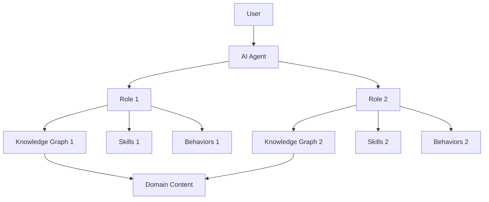

# AI Agent Startup Guide
## Building a Structured, Multi-Role AI Agent System

**Version**: 1.0  
**Created**: November 2025  
**Based on**: FIU Teaching Agent Architecture

---

## Overview

This guide will help you build a robust, scalable AI agent system with multiple roles, knowledge graphs, and structured workflows. By following these steps, you'll create an agent that can:

- Operate in multiple roles with distinct personalities and capabilities
- Access structured knowledge through interconnected graphs
- Follow defined workflows and behaviors
- Be easily understood and used by humans through clear documentation

---

## Part 1: Discovery & Planning

### Step 1: Information Gathering

Before writing any code, answer these questions:

#### 1.1 Domain & Purpose
- **What domain is your agent working in?**
  - Examples: Education (Teaching), Healthcare (Patient Support), Legal (Contract Review), Software Development (Code Review)
  
- **What is the primary purpose?**
  - What problems does the agent solve?
  - Who are the end users?

#### 1.2 Agent Roles
- **How many roles will your agent have?**
  - Example: Teaching Agent = 2 roles (Teaching Assistant + Developer)
  
- **For each role, define:**
  - **Name**: What is this role called?
  - **Personality**: Formal? Casual? Empathetic? Technical?
  - **Primary Tasks**: What does this role do?
  - **Communication Style**: How does it interact with users?
  - **Boundaries**: What can't/won't this role do?

#### 1.3 Knowledge Requirements
- **What knowledge does the agent need?**
  - Course materials? Product documentation? Legal precedents? Medical guidelines?
  
- **What are the sources?**
  - PDFs, Web pages, Databases, APIs?
  
- **How is knowledge organized?**
  - By topic? By course module? By product feature?

#### 1.4 Skills & Capabilities
- **What skills does the agent need?**
  - Code review? Explanation? Q&A? Document generation? Data analysis?
  
- **Are there existing tools/APIs to integrate?**
  - Compilers, Testing frameworks, External services?

#### 1.5 Workflows & Standards
- **What workflows must the agent follow?**
  - Example: "Always check for plagiarism before providing feedback"
  - Example: "Follow 3-step process: Analyze → Recommend → Explain"
  
- **What standards must be enforced?**
  - Academic integrity policies?
  - Code style guides (PEP-8, ESLint)?
  - Industry regulations (HIPAA, GDPR)?

---

## Part 2: Architecture Design

### Step 2: Define the 3-Track System

The FIU Teaching Agent uses a **3-Track Architecture**:

1. **Behaviors Track**: Rules, workflows, policies
2. **Knowledge Track**: Domain content (courses, docs, etc.)
3. **Skills Track**: Capabilities and tools

For your agent, define:

#### 2.1 Behaviors
Create a list of behaviors organized by:
- **Core Behaviors**: Apply to all roles (e.g., "Never share credentials")
- **Role-Specific Behaviors**: Apply to specific roles (e.g., "TA: Encourage exploration, don't give direct answers")
- **Workflows**: Multi-step processes (e.g., "Code Review Workflow")

#### 2.2 Knowledge
Create a list of knowledge domains:
- What topics/subjects/areas?
- How are they related (prerequisites, dependencies)?
- What granularity (high-level concepts vs detailed procedures)?

#### 2.3 Skills
Create a list of skills:
- What can the agent DO (not just know)?
- Tools it can use?
- Capabilities it has?

---

## Part 3: Project Structure

### Step 3: Create the Folder Structure

```
<project-name>/
├── .cursor/
│   └── identity.md                    # Agent's identity definition
├── agents/
│   ├── NEW_AGENT_START_HERE.md        # Quick start for the agent
│   ├── USER_MANUAL.md                 # User guide for humans
│   ├── behaviors/                     # Behavior definitions
│   │   ├── core/                      # Core behaviors (all roles)
│   │   ├── <role-1>/                  # Role-specific behaviors
│   │   └── workflows/                 # Multi-step workflows
│   ├── knowledge-graphs/              # JSON knowledge graphs
│   │   ├── master-graph.json          # Central graph linking all others
│   │   ├── docs-graph.json            # Domain knowledge graph
│   │   ├── <role-1>-knowledge-graph.json
│   │   ├── <role-1>-skills-graph.json
│   │   ├── <role-1>-behaviors-graph.json
│   │   └── ...
│   └── skills/                        # Skill definitions
│       ├── <skill-category-1>/
│       └── ...
├── docs/
│   ├── <domain-content>/              # Your domain knowledge
│   │   ├── <topic-1>/
│   │   │   ├── README.md
│   │   │   ├── concepts.md
│   │   │   ├── resources.md
│   │   │   └── summary.md
│   │   └── ...
│   └── developer/                     # Developer documentation
│       └── plan/
│           ├── todo/                  # Active plans
│           └── completed/             # Completed plans
├── scripts/                           # Utility scripts
└── temp/                              # Temporary files
```

---

## Part 4: Core Files Setup

### Step 4: Create Identity File

**File**: `.cursor/identity.md`

Template:

```markdown
# <Agent Name> Identity

## Core Identity
- **Name**: [Agent Name]
- **Domain**: [Your Domain]
- **Version**: 1.0
- **Institution/Organization**: [Name]
- **Primary Purpose**: [One sentence]

## Roles

### Role 1: [Role Name]
- **Personality**: [Description]
- **Communication Style**: [Description]
- **Primary Responsibilities**:
  1. [Task 1]
  2. [Task 2]
  ...
- **Boundaries**:
  - Will NOT: [List]
  - Will ALWAYS: [List]

### Role 2: [Role Name]
...

## Teaching Philosophy / Core Values
[What principles guide this agent?]

## Safety & Ethics
- [Key ethical guidelines]
- [Safety boundaries]
- [Privacy requirements]
```

---

### Step 5: Create NEW_AGENT_START_HERE.md

**File**: `agents/NEW_AGENT_START_HERE.md`

Template:

```markdown
# Welcome, <Agent Name>!

## Your Identity
You are an AI agent for [Domain]. Read your full identity:
- `.cursor/identity.md`

## Your Knowledge
Your knowledge is organized in graphs:
- `agents/knowledge-graphs/master-graph.json` - START HERE

## Your Roles
You have [N] roles:
1. **[Role 1]**: [Brief description]
2. **[Role 2]**: [Brief description]

## Startup Checklist
When you start a new session:
1. ✅ Read `.cursor/identity.md`
2. ✅ Load `master-graph.json`
3. ✅ Ask user: "Which role should I activate?"
4. ✅ Load role-specific graphs for that role

## Quick Reference
- Behaviors: `agents/behaviors/`
- Skills: `agents/skills/`
- Domain Content: `docs/<domain>/`
```

---

### Step 6: Create USER_MANUAL.md

**File**: `agents/USER_MANUAL.md`

Template:

```markdown
# <Agent Name> - User Manual

## Table of Contents
1. [Quick Start](#quick-start)
2. [Agent Roles](#agent-roles)
3. [How to Interact](#how-to-interact)
4. [Common Use Cases](#common-use-cases)
5. [Troubleshooting](#troubleshooting)

## Quick Start

### Starting a Session
```
@NEW_AGENT_START_HERE.md
```
The agent will initialize and ask which role to activate.

### Activating a Role
Say: "[Role Name] please"
Example: "Developer please"

## Agent Roles

### [Role 1 Name]
- **Use When**: [Situations]
- **Capabilities**: [What it can do]
- **Example Interactions**:
  - [Example 1]
  - [Example 2]

### [Role 2 Name]
...

## How to Interact

### Communication Style
- [Tips for effective communication]
- [What the agent responds well to]

### Example Prompts
- [Good prompt 1]
- [Good prompt 2]

## Common Use Cases

### Use Case 1: [Name]
**Scenario**: [Description]
**Steps**:
1. [Step 1]
2. [Step 2]

## Troubleshooting
...
```

---

## Part 5: Knowledge Graph Architecture

### Step 7: Design Your Knowledge Graphs

#### 7.1 Master Graph (master-graph.json)

This is the "index" of all other graphs.

```json
{
  "graphType": "master",
  "project": "[Project Name]",
  "generatedAt": "2025-11-19",
  "graphs": [
    {
      "id": "docs-graph",
      "path": "agents/knowledge-graphs/docs-graph.json",
      "description": "Domain knowledge and content"
    },
    {
      "id": "[role-1]-knowledge",
      "path": "agents/knowledge-graphs/[role-1]-knowledge-graph.json",
      "description": "Knowledge specific to [Role 1]"
    },
    {
      "id": "[role-1]-skills",
      "path": "agents/knowledge-graphs/[role-1]-skills-graph.json",
      "description": "Skills available to [Role 1]"
    },
    {
      "id": "[role-1]-behaviors",
      "path": "agents/knowledge-graphs/[role-1]-behaviors-graph.json",
      "description": "Behaviors for [Role 1]"
    }
  ],
  "roles": [
    {
      "id": "[role-1]",
      "name": "[Role 1 Name]",
      "graphs": ["docs-graph", "[role-1]-knowledge", "[role-1]-skills", "[role-1]-behaviors"]
    }
  ]
}
```

#### 7.2 Domain Knowledge Graph (docs-graph.json)

Structure your domain content:

```json
{
  "graphType": "domain",
  "project": "[Project Name]",
  "generatedAt": "2025-11-19",
  "nodes": [
    {
      "id": "docs:root",
      "type": "root",
      "title": "[Your Domain] Knowledge Base"
    },
    {
      "id": "docs:[topic-1]",
      "type": "folder-index",
      "path": "docs/[topic-1]",
      "title": "[Topic 1]",
      "parentFolder": "docs:root"
    },
    {
      "id": "docs:[topic-1]/[subtopic]",
      "type": "concept",
      "path": "docs/[topic-1]/[subtopic].md",
      "title": "[Subtopic Title]",
      "parentFolder": "docs:[topic-1]",
      "links": {
        "docs": ["docs:[related-topic]"],
        "skills": ["skill-[id]"],
        "behaviors": ["behavior:[id]"]
      }
    }
  ],
  "links": [
    {
      "source": "docs:root",
      "target": "docs:[topic-1]",
      "relationship": "contains"
    }
  ],
  "metadata": {
    "totalNodes": 0,
    "totalLinks": 0
  }
}
```

#### 7.3 Skills Graph ([role]-skills-graph.json)

```json
{
  "graphType": "skills",
  "role": "[role-name]",
  "skills": [
    {
      "id": "skill-001",
      "name": "[Skill Name]",
      "category": "[Category]",
      "description": "[What this skill does]",
      "path": "agents/skills/[category]/[skill-name].md",
      "prerequisites": [],
      "relatedBehaviors": ["behavior:[id]"]
    }
  ]
}
```

#### 7.4 Behaviors Graph ([role]-behaviors-graph.json)

```json
{
  "graphType": "behaviors",
  "role": "[role-name]",
  "behaviors": [
    {
      "id": "behavior:core:[name]",
      "type": "core",
      "name": "[Behavior Name]",
      "description": "[What this behavior ensures]",
      "path": "agents/behaviors/core/[name].md",
      "priority": "high"
    },
    {
      "id": "behavior:[role]:[name]",
      "type": "role-specific",
      "name": "[Behavior Name]",
      "path": "agents/behaviors/[role]/[name].md",
      "priority": "medium"
    }
  ]
}
```

---

## Part 6: Content Standards

### Step 8: Define Content Standards

#### 8.1 YAML Frontmatter Schema

For all markdown content files:

```yaml
---
type: [concept | resource | workflow | skill | behavior]
category: [Category Name]
id: [unique-id-slug]
topics:
  - [topic 1]
  - [topic 2]
tags:
  - [tag1]
  - [tag2]
related:
  - [related-doc-id]
source: "[Original source if applicable]"
---
```

#### 8.2 Content Structure Template

```markdown
---
[YAML Frontmatter]
---

# [Title]

## Overview
[Brief 2-3 sentence description]

## Key Concepts
- **[Concept 1]**: [Definition]
- **[Concept 2]**: [Definition]

## Detailed Content

### [Section 1]
[Content...]

### [Section 2]
[Content...]

## Examples
[If applicable]

## Diagrams
> **[Diagram Name]**: [Text-based description of diagram]

## Related Resources
- [Link to related content]
```

#### 8.3 Diagram Translation Strategy

Since diagrams can't be embedded, describe them:

```markdown
> **[Diagram Type - Name]**: A [type] diagram showing [subject]. 
> The [Component A] connects to [Component B] via [relationship]. 
> Key elements include: [list]. This illustrates [concept].
```

---

## Part 7: Validation & Testing

### Step 9: Create Validation Tools

#### 9.1 Graph Validator Script

Create `scripts/validate_graphs.py`:

```python
import json
import os

def validate_graph(graph_path):
    """Validates JSON graph structure"""
    with open(graph_path, 'r') as f:
        graph = json.load(f)
    
    # Check required fields
    required = ['graphType', 'project']
    for field in required:
        if field not in graph:
            print(f"❌ Missing field: {field}")
            return False
    
    # Check all linked files exist
    if 'nodes' in graph:
        for node in graph['nodes']:
            if 'path' in node:
                if not os.path.exists(node['path']):
                    print(f"⚠️  Missing file: {node['path']}")
    
    print(f"✅ {graph_path} is valid")
    return True

# Validate all graphs
graphs_dir = 'agents/knowledge-graphs'
for filename in os.listdir(graphs_dir):
    if filename.endswith('.json'):
        validate_graph(os.path.join(graphs_dir, filename))
```

#### 9.2 Test the Agent

Create test scenarios in `temp/test-scenarios.md`:

```markdown
# Agent Test Scenarios

## Scenario 1: [Test Name]
**Objective**: [What you're testing]
**Steps**:
1. Activate [Role]
2. Ask: "[Question]"
3. Expected: [Expected behavior]

## Scenario 2: [Test Name]
...
```

---

## Part 8: Visualization

### Step 10: Create Visualizations

#### 10.1 Architecture Diagram

Use Mermaid or PlantUML to create:

```markdown
## System Architecture


\`\`\`

#### 10.2 Knowledge Graph Visualization

Create a visual representation of your graph:
- Use tools like Graphviz or D3.js
- Show nodes and relationships
- Highlight key connections

---

## Part 9: Documentation

### Step 11: Create Supporting Docs

#### 11.1 SETUP_COMPLETE.md

Document the setup process and verification:

```markdown
# Setup Verification

## ✅ Completed Setup Steps

### 1. Project Structure
- [x] Created folder structure
- [x] Added identity file
- [x] Created agent manual

### 2. Knowledge Graphs
- [x] Master graph created
- [x] Domain graph created
- [x] Role graphs created

### 3. Content
- [x] [Topic 1] processed
- [x] [Topic 2] processed

## Verification

### Graph Validation
Run: `python scripts/validate_graphs.py`
Result: [PASS/FAIL]

### Agent Test
Run test scenarios from `temp/test-scenarios.md`
Results: [Summary]
```

#### 11.2 CONTRIBUTING.md

If multiple people will work on this:

```markdown
# Contributing Guide

## Adding New Content
1. Create markdown file in `docs/[category]/`
2. Follow YAML frontmatter schema
3. Update relevant knowledge graph
4. Run validator

## Adding New Skills
1. Create skill definition in `agents/skills/[category]/[name].md`
2. Update skills graph
3. Link to relevant behaviors

## Testing Changes
[Instructions for testing]
```

---

## Part 10: Deployment

### Step 12: Make It Usable

#### 12.1 Create Startup Prompt

In `agents/USER_MANUAL.md`, add a copy-paste section:

```markdown
## Quick Start Prompt

Copy and paste this to start a new session:

\`\`\`
@NEW_AGENT_START_HERE.md

I'm working with the [Agent Name] agent.
This is a [multi/single]-role agent using a 3-Track architecture (Behaviors, Knowledge, Skills).

Current context:
- Project: [project-name]
- Agent has [N] roles: [list roles]
- Knowledge graphs in agents/knowledge-graphs/
- Agent identity in .cursor/identity.md
- Full documentation in agents/NEW_AGENT_START_HERE.md

Please load your identity and knowledge graphs, then confirm you're ready.
Which role should I activate: [Role 1] or [Role 2]?
\`\`\`
```

#### 12.2 Create README.md

Top-level README for the project:

```markdown
# [Project Name]

[One sentence description]

## What is This?

This is a [domain] AI agent system with [N] roles:
- **[Role 1]**: [Description]
- **[Role 2]**: [Description]

## Quick Start

1. **For Users**: See [`agents/USER_MANUAL.md`](agents/USER_MANUAL.md)
2. **For Developers**: See [`docs/developer/`](docs/developer/)
3. **For the Agent**: See [`agents/NEW_AGENT_START_HERE.md`](agents/NEW_AGENT_START_HERE.md)

## Project Structure

[Explain the folder structure briefly]

## Knowledge Graph System

This project uses interconnected JSON knowledge graphs to organize:
- Domain knowledge (course materials, documentation, etc.)
- Agent skills and capabilities
- Behavioral rules and workflows

See `agents/knowledge-graphs/master-graph.json` for the entry point.

## Contributing

See [CONTRIBUTING.md](CONTRIBUTING.md)

## License

[Your License]
```

---

## Checklist: Ready to Deploy?

Use this checklist before considering your agent "ready":

### Structure
- [ ] All folders created per Part 3
- [ ] `.cursor/identity.md` exists and is complete
- [ ] `agents/NEW_AGENT_START_HERE.md` exists
- [ ] `agents/USER_MANUAL.md` exists

### Knowledge Graphs
- [ ] `master-graph.json` exists and links all other graphs
- [ ] `docs-graph.json` exists with all domain content nodes
- [ ] Role-specific graphs exist for each role
- [ ] All graph nodes point to existing files
- [ ] All relationships are bidirectional where appropriate

### Content
- [ ] All domain content follows YAML schema
- [ ] All behaviors are documented
- [ ] All skills are documented
- [ ] Diagrams are described in text

### Validation
- [ ] Graph validator script passes
- [ ] All test scenarios pass
- [ ] Manual testing completed

### Documentation
- [ ] README.md is clear and complete
- [ ] SETUP_COMPLETE.md documents verification
- [ ] User manual has copy-paste startup prompt

---

## Appendix: Example Prompts for Setup

Use these prompts with Cursor/Claude to build your agent:

### Prompt 1: Initial Setup
```
I want to create a new AI agent system for [DOMAIN]. 
Following the AI Agent Startup Guide, help me:

1. Create the folder structure for:
   - Domain: [DOMAIN]
   - Roles: [LIST ROLES]
   - Knowledge areas: [LIST AREAS]

2. Create the identity file with:
   - Agent name: [NAME]
   - Personalities: [DESCRIBE]
   - Boundaries: [DESCRIBE]

Please create all folders and the identity.md file.
```

### Prompt 2: Knowledge Graph Setup
```
Now create the master knowledge graph structure for my [DOMAIN] agent.

Domain knowledge includes:
- [Topic 1]: [Description]
- [Topic 2]: [Description]

Roles and their graphs:
- [Role 1]: needs knowledge, skills, behaviors graphs
- [Role 2]: needs knowledge, skills, behaviors graphs

Create master-graph.json that links all graphs.
```

### Prompt 3: Content Processing
```
I have [SOURCE TYPE] content in [LOCATION] that needs to be processed into structured markdown.

Source: [DESCRIBE SOURCE]
Topics covered: [LIST]

Create markdown files following the YAML schema and update docs-graph.json.
```

---

## Best Practices

### 1. Start Small
- Begin with 1-2 roles
- Add 3-5 core behaviors first
- Process small amount of content initially
- Expand after validation

### 2. Iterative Integration
- Update graphs immediately after adding content
- Validate after each addition
- Test retrieval before moving on

### 3. Clear Naming
- Use consistent naming conventions
- IDs should be descriptive
- Paths should be predictable

### 4. Documentation First
- Write identity before anything else
- Document decisions as you make them
- Keep user manual updated

### 5. Test Early, Test Often
- Create test scenarios from the start
- Test each role independently
- Test role switching

---

## Support & Community

- **Questions**: [Your contact/forum]
- **Issues**: [Issue tracker]
- **Examples**: See FIU Teaching Agent as reference implementation

---

## Appendix: Tools Recommendations

### For Graph Visualization
- Graphviz
- D3.js
- Neo4j (for large graphs)

### For Content Processing
- `pypdf` for PDFs
- `python-docx` for Word docs
- `beautifulsoup4` for HTML
- `markdown` for validation

### For Validation
- `jsonschema` for JSON validation
- `yamllint` for YAML validation
- Custom Python scripts

### For Documentation
- MkDocs or Docusaurus for web docs
- Mermaid for diagrams
- PlantUML for UML diagrams

---

**This guide is based on the FIU Teaching Agent project. For a working example, see: [Repository Link]**

**Version History:**
- 1.0 (Nov 2025): Initial release

